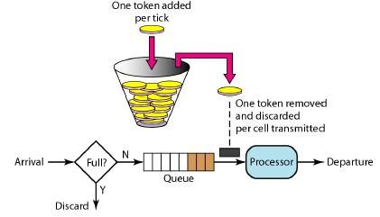

### Rate Limiter
降级和限流是面对大流量必不可少的神兵利器. 流量控制算法就是通过网络整形或者速率控制来解决此类问题.

### 流量控制算法
- 令牌桶算法
- 漏桶算法

#### 令牌桶算法
- 每秒会有 r 个令牌放入桶中，或者说，每过 1/r 秒桶中增加一个令牌
- 桶中最多存放 b 个令牌，如果桶满了，新放入的令牌会被丢弃
- 当一个 n 字节的数据包到达时，消耗 n 个令牌，然后发送该数据包
- 如果桶中可用令牌小于 n，则该数据包将被缓存或丢弃
- 